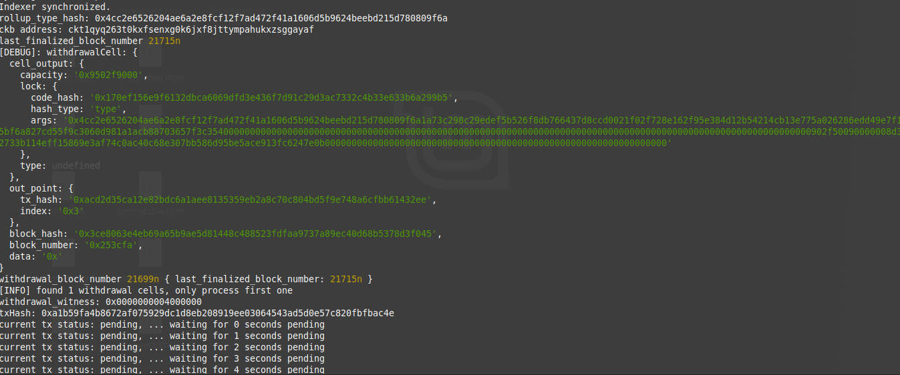
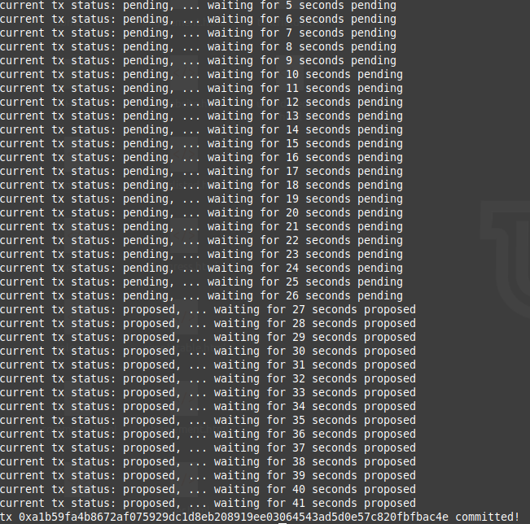

# Task 10 - Complete Withdrawal Process By Unlocking The Funds
1. A screenshot of the console output immediately after running the "unlock" command:




2. The Ethereum address that you've used for your Layer 2 account (in text format):
```
0x2Bd2a93966C028D192aE932b7d5fc721822257F0
```

3. The Nervos Layer 1 address associated with the private key passed to "unlock" command (in text format):
```
ckt1qyq263t0kxfsenxg0k6jxf8jttympahukxzsggayaf
```
