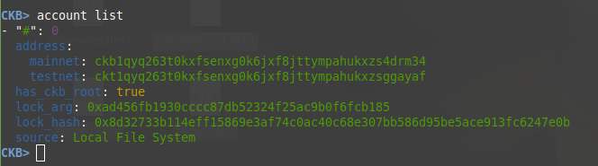
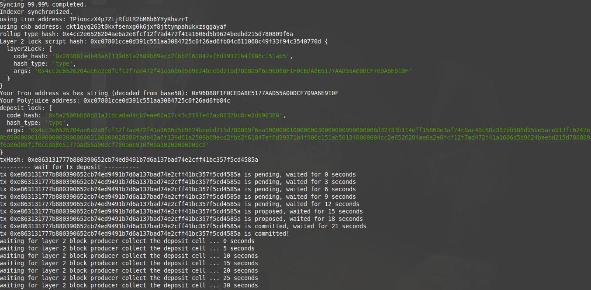
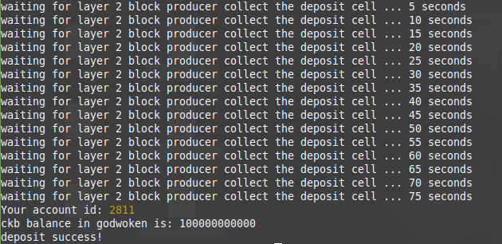
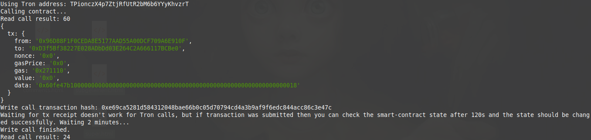

# Task 11 -  Use A Tron Wallet To Execute A Smart Contract Call
---
## 1) A screenshot of the accounts you created (account list) in ckb-cli:


---
## 2) A link to the Layer 1 address you funded on the Testnet Explorer:
https://explorer.nervos.org/aggron/address/ckt1qyq263t0kxfsenxg0k6jxf8jttympahukxzsggayaf

---
## 3) A screenshot of the console output immediately after you have successfully submitted a CKByte deposit to your Tron account on Layer 2:



---
## 4) A screenshot of the console output immediately after you have successfully issued a smart contract calls on Layer 2:


---
## 5) The transaction hash from the console output:
```
0xe69ca5281d584312048bae66b0c05d70794cd4a3b9af9f6edc844acc86c3e47c
```
---
## 6) The contract address that you called:
```
0xD3f5Bf38227E028ADbDd03E264C2A666117BCBe0
```
---
## 7) The ABI for contract you made a call on:
```
[
    {
      "inputs": [],
      "stateMutability": "payable",
      "type": "constructor"
    },
    {
      "inputs": [
        {
          "internalType": "uint256",
          "name": "x",
          "type": "uint256"
        }
      ],
      "name": "set",
      "outputs": [],
      "stateMutability": "payable",
      "type": "function"
    },
    {
      "inputs": [],
      "name": "get",
      "outputs": [
        {
          "internalType": "uint256",
          "name": "",
          "type": "uint256"
        }
      ],
      "stateMutability": "view",
      "type": "function"
    }
]
```
---
## 8) Your Tron address:
```
TPionczX4p7ZtjRfUtR2bM6b6YYyKhvzrT
```
