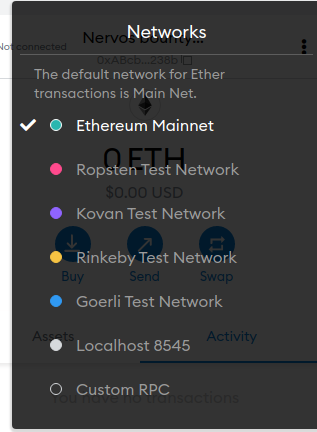

# Task 12 - Porting a Dapp on Ethereum over to Polyjuice

This article will will guide how to port over an exisiting Ethereum Dapp over to the Nervos Polyjuice. Hope this article will help you participate in the Nervos Ecosystem.
---
## 1) Setup Metamask RPC
For the Dapp to be compatible with Metamask you have to configure it to communicate with the Godwoken Layer 2 Network. You are able to do this using the "Custom RPC" on Metamask.



You are now able to fill in the fields with the following information:
```
Network Name: Godwoken Testnet
RPC URL: https://godwoken-testnet-web3-rpc.ckbapp.dev
Chain ID: 71393
Currency Symbol: N/A
Block Explorer URL: N/A
```
---
# 2) Select Ethereum DApp
Now you would like to search for an exisiting Ethereum DApp you would like to port over to Polyjuice. You can also make you own Ethereum DApp then port it over yourself ater.

Once you have found or created the DApp you would like to port over you can now clone its repository.

In our case lets clone this Sample application here:
```
git clone https://github.com/JPeterD/SampleDapp
````
Now move inside its directory and install all of its dependencies, build the smart contract and start up Ganache.
Inside a different terminal start up the UI of the DApp.
```
yarn ui
```
Once it has been started try going to http://localhost:3000 to view the current DApp.
