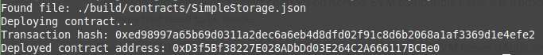

Task 2 - Deploy A Simple Ethereum Smart Contract On Polyjuice
===
1. A screenshot of the console output immediately after you have successfully deployed a smart contract:

2. The transaction hash from the contract deployment (in text format):

0xed98997a65b69d0311a2dec6a6eb4d8dfd02f91c8d6b2068a1af3369d1e4efe2

3. The deployed contract address from the contract deployment (in text format):

0xD3f5Bf38227E028ADbDd03E264C2A666117BCBe0
