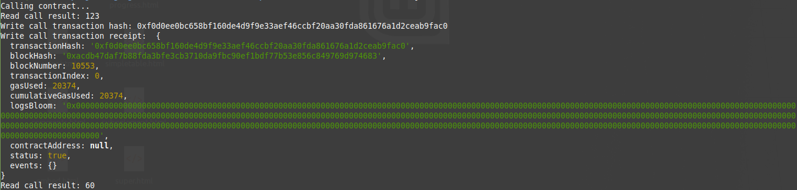

# Task 3 - Issue A Smart Contract Call To The Deployed Smart Contract
1. A screenshot of the console output immediately after you have successfully issued a smart contract call.


2. The transaction hash from the console output (in text format).
```
0xf0d0ee0bc658bf160de4d9f9e33aef46ccbf20aa30fda861676a1d2ceab9fac0
```
4. The contract address that you called (in text format).
```
0xD3f5Bf38227E028ADbDd03E264C2A666117BCBe0
```
6. The ABI for contract you made a call on (in text format).
```
[
    {
      "inputs": [],
      "stateMutability": "payable",
      "type": "constructor"
    },
    {
      "inputs": [
        {
          "internalType": "uint256",
          "name": "x",
          "type": "uint256"
        }
      ],
      "name": "set",
      "outputs": [],
      "stateMutability": "payable",
      "type": "function"
    },
    {
      "inputs": [],
      "name": "get",
      "outputs": [
        {
          "internalType": "uint256",
          "name": "",
          "type": "uint256"
        }
      ],
      "stateMutability": "view",
      "type": "function"
    }
  ]
```
