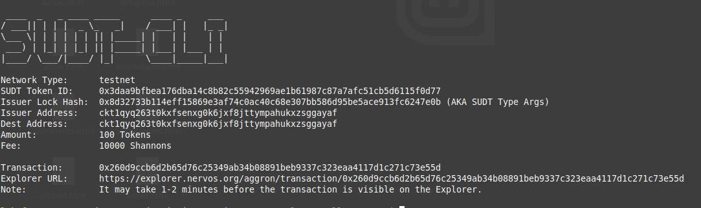

# Task 4 - Issue an SUDT Token on Layer 1 and Deposit it to Layer 2
---
## 1) Link to layer 1 address
[Layer 1 Address Link!](https://explorer.nervos.org/aggron/address/ckb1qyq263t0kxfsenxg0k6jxf8jttympahukxzs4drm34)
---
## 2)Screenshot of sudt-cli output

---
## 3) Link to transaction ID
[Transaction ID on Block Explorer](https://explorer.nervos.org/aggron/transaction/0x260d9ccb6d2b65d76c25349ab34b08891beb9337c323eaa4117d1c271c73e55d/)
---
## 4) Screenshot of the output after deposit to layer 2

---
## 5) SUDT ID: X
