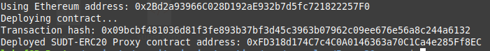
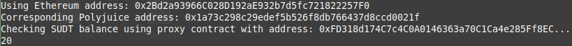

# Task 5 - Deploy The ERC20 Proxy Contract For The Deposited SUDT
---
## 1) Screenshoot of Deployment

---
## 2)Address of ERC20 Proxy Contract
```
0xFD318d174C7c4C0A0146363a70C1Ca4e285Ff8EC
```
---
## 3) Screenshot Check SUDT Balance

---
## 4) Ethereum Address that was Checked
```
0x2Bd2a93966C028D192aE932b7d5fc721822257F0
```
