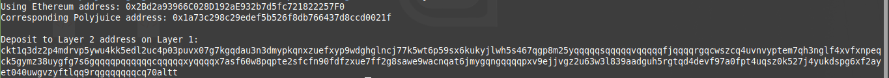

# Task 6 - Use Force Bridge To Deposit Tokens From Ethereum To Polyjuice
---
## 1) Screenshot of Output after Deposit Receiver Generation

---
## 2)Deposit Receiver Address
```
ckt1q3dz2p4mdrvp5ywu4kk5edl2uc4p03puvx07g7kgqdau3n3dmypkqnxzuefxyp9wdghglncj77k5wt6p59sx6kukyjlwh5s467qgp8m25yqqqqqsqqqqqvqqqqqfjqqqqrgqcwszcq4uvnvyptem7qh3nglf4xvfxnpeqck5gymz38uygfg7s6gqqqqpqqqqqqcqqqqqxyqqqqx7asf60w8pqpte2sfcfn90fdfzxue7ff2g8sawe9wacnqat6jmygqngqqqqpxv9ejjvgz2u63w3l839aadguh5rgtqd4devf97a0fpt4uqsz0k527j4yukdspg6xf2ayet040uwgvzyftlqq9rqgqqqqqqcq70altt
```
---
## 3) Link to Etherscan of Successful Force Bridge
[Etherscan Successful Bridge Link!](https://rinkeby.etherscan.io/tx/0xc0a0558ecee918070499943d38fe4238e0b3472dacc7c7ff698334be9ce2488b)
---
## 4) Link to Nervos Explorer of Successful Force Bridge
[Nervos Explorer Sucessful Bridge Link!](https://explorer.nervos.org/aggron/transaction/0x89abb4610e19c62d056188c2b600af766adc2fd7e625c8d430bc1372a220eea5)

