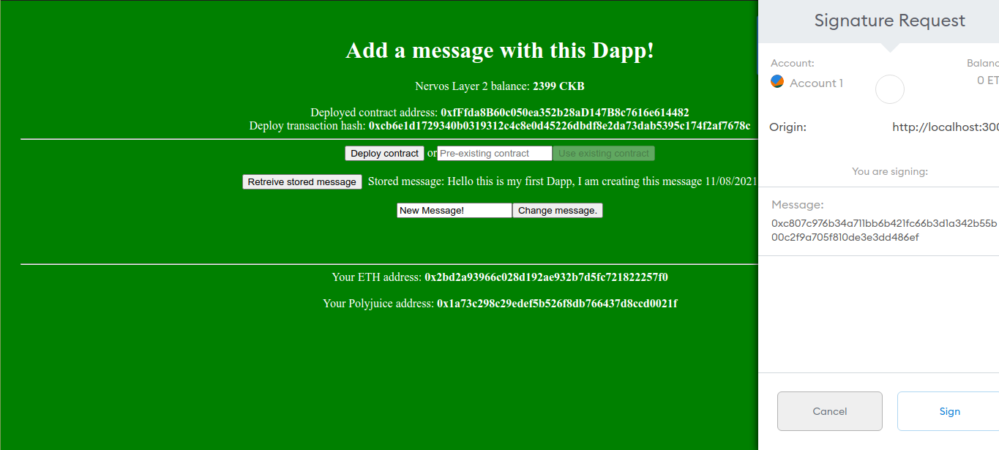
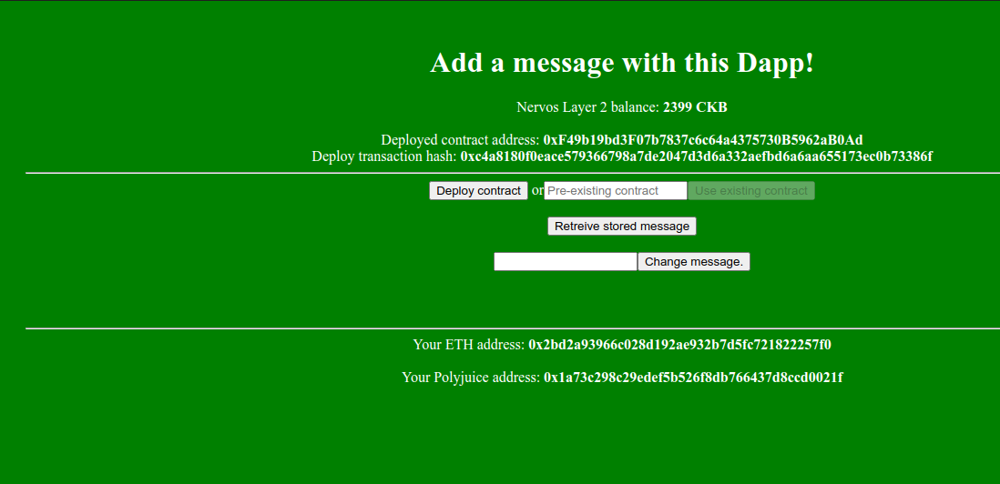

# Task 7 - Port An Existing Ethereum DApp To Polyjuice
---
## 1) Screenshot of Application on Godwin


---
## 2) Link to Gitub Repository:
https://github.com/JPeterD/SampleDapp
---
## 3) Transaction Hash of Deployment Transaction:
```
0xc4a8180f0eace579366798a7de2047d3d6a332aefbd6a6aa655173ec0b73386f
```
---
## 4) Deployed Contract Address:
```
0xF49b19bd3F07b7837c6c64a4375730B5962aB0Ad
```
## 5) ABI:
```
[
    {
      "inputs": [],
      "stateMutability": "payable",
      "type": "constructor"
    },
    {
      "inputs": [],
      "name": "retrieveMessage",
      "outputs": [
        {
          "internalType": "string",
          "name": "",
          "type": "string"
        }
      ],
      "stateMutability": "view",
      "type": "function"
    },
    {
      "inputs": [
        {
          "internalType": "string",
          "name": "newMessage",
          "type": "string"
        }
      ],
      "name": "placeMessage",
      "outputs": [],
      "stateMutability": "nonpayable",
      "type": "function"
    }
  ]
```
