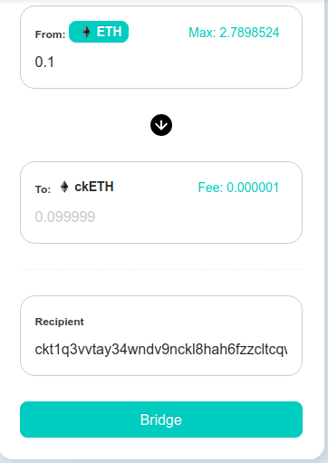

# Task 8 -  Modify The Ported DApp So It Supports Ethereum Assets Via Force Bridge
---
## 1) Screenshot of EVM Application on Layer 2 with Force Bridge Support:


# Depositing Funds


# After Deposit


---
## 2)CkETH SUDT Proxy Contract Address:
```
0x7d05aBe9ea933d67eB78E0992Ef3c9c70ce6C3d7
```
---
## 3) Github Link of Repo with Force Bridge support:
https://github.com/JPeterD/Gitcoin-Nervos/tree/main/Task%208/MessageCreationDapp
